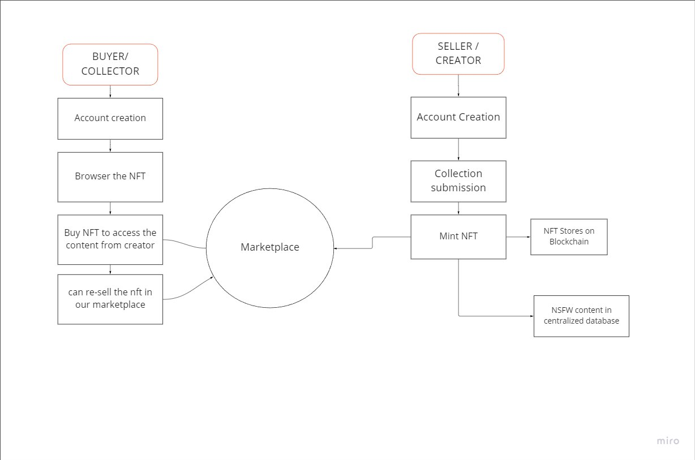

  # Mintbase Grant Proposal
 **Project Name:** "Allie's Marketplace"

**Team Name:** Marmaj DAO

**Payment Address**: marmaj.sputnik-dao.near

**Level:** 1
  

## Project Overview :page_facing_up: 

### Overview
**A tag line:**  Adult-centric NFT marketplace 18+

**Project description:**  Allie’s Marketplace is an NFT marketplace built on NEAR Protocol. This is a hub for Allie’s own content and where her fans can buy her NFTs. The marketplace will also offer a variety of other content, including: videos, photos, and articles from Allie. The marketplace will be open to anyone who wants to purchase Allie’s content, and all transactions will be processed on the blockchain. This will provide a secure and efficient way for Allie to sell her content and connect with her fans.

  

**Goal:**

  

Our goal is to encourage web3 space adoption and utilisation by not-safe-for-work (NSFW) content producers through the development of a user-friendly and engaging NFT marketplace.

  

Since our software is open source, anyone can use it to create their own decentralised marketplace. For creators who struggle to make money on centralised platforms and do not have full control over their content, this will be incredibly helpful. Because the marketplaces built on this code will be decentralised, they will also be shielded from censorship.

  

The planned flow is as follows: 
1) users go to the website and connect their wallets* to purchase NFTs and gain access to the content; 
2) they can then make offers on the NFTs listed; 
3) following the conclusion of the bidding, the buyer receives ownership of the NFT. If the user does not have a wallet, there will be the ability to create one instantly.

  
  

**An indication of how your project relates to / integrates into the Mintbase / NEAR ecosystem:**

  

This project relates to Mintbase and the NEAR ecosystem because it will allow not only Allie, but any other adult content creators the ability to spin up their needed tools in a decentralised manner.

  

**An indication of why your team is interested in creating this project:**

  

We are interested because we see how many creators are at the mercy of centralised platforms to distribute their content. The goal is to provide open source tools to support all creators, starting with one special creator.

  

  

### Project Details:

  

**Flow Chart Diagram:**

**Technology stack:**
- Backend:
	- MongoDB

	- AWS S3 (For censored content storage)

	- Express.js

	- Node.js

	- Near javascript-sdk (for smart contract)

	- Arweave (For NFT Pass Storage)

  

- Frontend:

	- React
	
	- Tailwind CSS

### Ecosystem Fit

**Where and how does your project fit into the ecosystem?**
	Right on top of Mintbase (as well as other Dapps hopefully). As people learn about Mintbase and the tools offered in the Mintbase toolkit, we hope that content creators looking for more delicate handling of their projects will look at this project.

**Who is your target audience (parachain/dapp/wallet/UI developers, designers, your own user base, some dapp's user base, yourself)?**

Target audience is generally NSFW content creators to spin up and use our contracts as well as consumers of the content who will be collecting NFTs.

We also hope to integrate with various chains to ensure that funds can reach intended creators from any chain.

**What need(s) does your project meet?**
The need for open source web3 tools that support NSFW content creators.

**If so, how is your project different?**

Our project hopes to focus specifically on the sensitive nature of NSFW content creation and aims to focus on helping these creators use web3 tools to create self-sustaining economies for themselves.

 **If not, are there similar projects in related ecosystems?**
 Not that we have seen so far.

## Team

**Team leader:** Chole Lewis
**Team members:** Monish Muralidharan, Vijay Murugan, Allie Knox

**Contact name:** Chole Lewis
**Contact Email:** [chloe@marmaj.org](mailto:chloe@marmaj.org)

  
 **Team Code Repos:**

  

  

  

- https://github.com/Kalankendra-DAO

  

- https://github.com/MarmaJFoundation

  

  

- https://github.com/Kalankendra-DAO/shardible
 
## Development Status:

Our initiative is still in its early stages. We couldn't locate anything similar to this project since it is a new concept in this chain. Our requirements must be better considered and created.

  

The development of this marketplace is complex as it is a new concept. First the project needs to be designed and planned. Then the necessary infrastructure has to be put in place. Once the marketplace is up and running it has to be properly marketed to its potential users. In order to ensure the success all these processes have to be met.

## Development Roadmap:

### Overview

  

  

  

-  **Total Estimated Duration:** 1.5 months

  

  

-  **Full-Time Equivalent (FTE):** 2.5 FTE

  

  

-  **Total Costs:** 10,000 USD

### Milestone 1 -  Implement smart contract and backend

  

  

  

-  **Estimated duration:** 2-3 weeks

  

  

-  **FTE:** 2.5 FTE

  

  

-  **Costs:** 6,000 USD

| Number | Deliverable | Specification |
| -----: | ----------- | ------------- |
| 0a. | License | MIT |
| 0b. | Documentation | We will provide inline documentation of the code how a user can use our factory contract for their marketplace. And how to set the code in the cloud. |
| 1. | Create account| Allie can update her Profile. |  
| 2. | Create Collection | To create a collection that stores the censored content in a centralised database and NFT in NEAR and Arweave.|  
| 3. | To unlock the content to the user | This function is to check if the connected wallet has any NFT of collection to unlock the content to that account.|  
  

### Milestone 2 — Enhanced Frontend and User Adoption
  

  

  

-  **Estimated Duration:** 4 weeks

  

  

-  **FTE:** 2

  

  

-  **Costs:** 4,000 USD

| Number | Deliverable | Specification |
| -----: | ----------- | ------------- |
| 0a. | License | MIT|
| 0b. | Documentation | Provide mockups and/or wireframes (e.g. Figma)

And documents on how to connect and buy and unlock the content of Allie’s (other content creator) |

### Future Plans:

-   The marketplace offers the owner Roketo payment services
    

  

-   The marketplace offers fundamental minting on Mintbase
    

  

-   For a lot of the front end and restricted content, we could even be able to collaborate with Gorilla Shops.
    

  

-   The marketplace offers organisational structure through Astro DAO (investment through tokens + Ref Finance).
    

  

Thus, all the necessary instruments are already in place, but need to be linked together. If we can accomplish that, we will attract more people and, in the long run, establish this model as a platform.

### Additional Information:

**How did you hear about the Grants Program?:**

  

From Twitter and being active in the NEAR Ecosystem.
