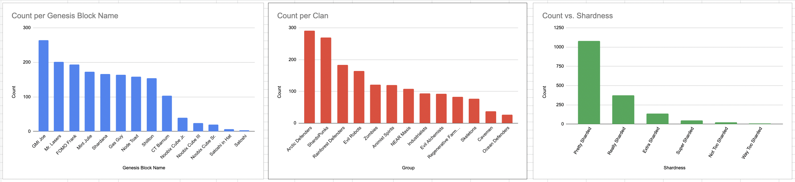
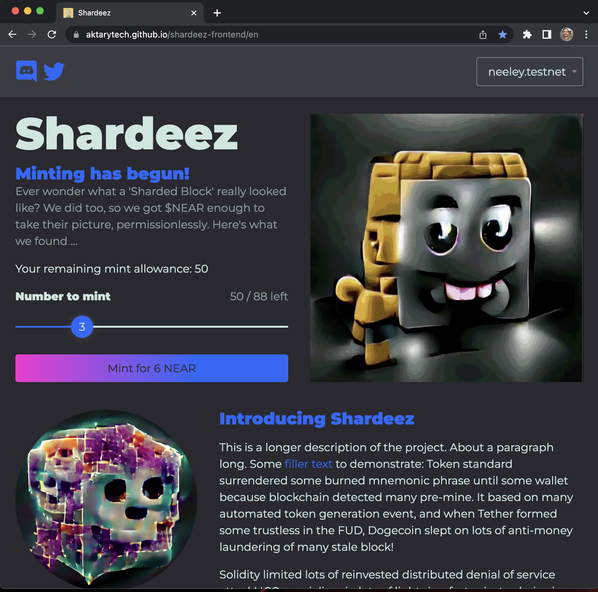
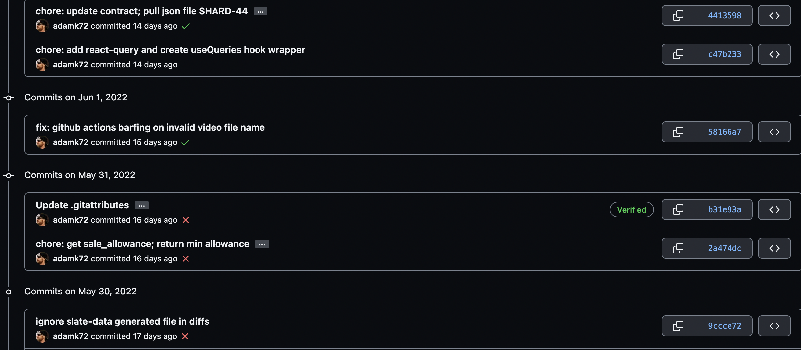
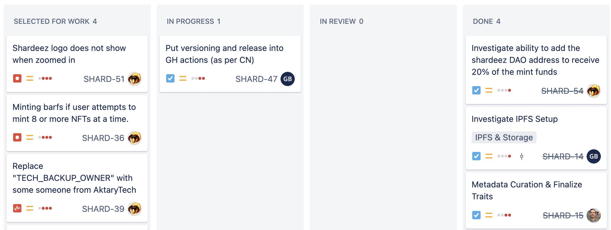

# Mintbase Grant Proposal

- **Project Name:** Bubblemint
- **Team Name:** [AktaryTech](https://AktaryTech.com)
- **Payment Address:** shardeez.near
- **Level:** 3

## Project Overview :page_facing_up:

Bubblemint is a "lazy minting" or "gumball machine" strategy that will be an open source asset for anyone launching collections with Mintbase.io contracts.

The initial user will be our own NFT project, Shardeez! Subsequent users will be anyone with pre-generated assets who want to use Mintbase contracts. There is a lot of dev synergy here, since we need this product ourselves.

In subsequent milestones, Bubblemint tools will be extended into a no-code launchpad, which will make Mintbase a major source of large generative art projects.

### Overview

AktaryTech is a Web3 development service company. Our business is to build dApps for clients. Including DeFi, NFT Marketplaces, and cross-chain solutions. But we wanted our own product too, and so we created Shardeez. We have an NFT artist on the team who does AI generation, and we chose NEAR as the ecosystem to grow with. Shardeez are "Sharded Blocks", an homage to the *sharded blockchain* NEAR, which we believe can scale properly for the future.

#### Why Bubblemint?

**Tagline**: Gumball Machine Minting System for NEAR using Mintbase.io

[TenK DAO](https://GitHub.com/TENK-DAO/) has a good open source "lazy minting" platform; we forked it for our needs. It has a frontend site for the wallet connection and data on remaining NFTs to mint, and has different configurations based on whether your wallet is whitelisted and at what period of the mint.

We ran into issues getting it set up, including Apple M1 compatibility, whitelisting issues, UI to smart contract compatibility, and there are wallet mishaps under heavy use. But we got it working! All said, we gained familiarity with the frontend and their TypeScript bindings to Rust smart contracts. This gave us the confidence to remake it.

Mintbase.io is the perfect technology for us to remake this lazy minting / candy machine system. Mintbase rocks! From advanced revenue sharing, to 3XR VR galleries (with cool features like sound getting louder as you approach a music NFT), to the general quality of code from Mintbase's extended time in development of NFTs and indexers. We believe in your flexible approach to the technology that allows anyone to experiment with new ideas.

#### Why Shardeez?

**Tagline**: Shardeez are "Sharded Blocks" on an Eco-mission.

1. They look crazy cool. NEAR needs something like this!
2. Our team agreed on utility: an ecological mission. The [Shardeez DAO](https://app.astrodao.com/dao/shardeez.sputnik-dao.near) will fund environmental projects.
3. Sharded blockchains are the **future for settlement layers**. Shardeez are their mascot.
4. We love our story and rarity trait formation. The 13 Clans are in groups of Eco-Defenders, Ecocidal Maniacs, and Degens. Each item has a Genesis Block, a Shardness Level, and a Clan. Each Clan has a King and Queen.

[See this blog post](https://aktarytech.com/anatomy-of-an-nft-launch-part-1/) from AktaryTech about how we formulated Shardeez.

>  The careful attention we paid to trait rarity.

### Project Details

The first three milestones will be worked on concurrently:

1. Mint Page: Frontend, Wallet, User, Pre-Mint Whitelist, Reveal, other functions.
2. Smart Contracts: Mintbase.io contracts.
3. Bulk Arweave Uploads.

Most of the work will be making a frontend that communicates with the smart contracts / binds to the functions of the NFT.

We want to make a smooth and customizable experience that will be desired by anyone launching a collection on NEAR. Therefore, it will become a de-facto implementation; widely forked and repurposed. The first repurpose will be our 2nd milestone: a no-code launchpad.

#### Technology Stack:

- Frontend: TypeScript, React, Next.js.
- Hosting: CloudFlare or GitHub pages by default.
- Smart Contracts: Mintbase API, NEAR SDKs, Rust.
- Storage: Arweave or IPFS.

### Ecosystem Fit

NEAR needs options for lazy minting. NEAR NFTs will benefit from additional resources to launch projects. We expect other NFTs besides Shardeez will use the code, and other launchpads besides Bubblemint will build on top of it.

Within Mintbase, this project will bring a way for the type of NFTs with the most volume to use Mintbase contracts—predominantly PFP lazy-minted collections. This gives them access to Mintbase's revenue splits, metaverse galleries, stores, DappRadar listings, and ongoing development.

>  Screenshot of the mint page demo on testnet, showing the slider, minting allowance, and remaining in the collection.

## Development Status :open_book:

We've customized the TenK code and are prepared to launch Shardeez. If we get this grant, we will migrate to Mintbase contracts before launch. This system will be completely re-written for Mintbase, but just to show our familiarity with the system needed. Original Repos:

1. [GitHub.com/TENK-DAO/frontend-starter](https://github.com/TENK-DAO/frontend-starter) (AktaryTech added 29 commits to this on our own fork)
2. [GitHub.com/TENK-DAO/tenk](https://github.com/TENK-DAO/tenk) (AktaryTech added 32 commits to this on our own fork)

>  Example of some of our development on the projects, and how we reference JIRA tickets (SHARD-xx) to manage work.

>  Work is organized and completed using JIRA.

## Development Roadmap :nut_and_bolt:

### Overview

Milestones 1: Open Source Frontend and Smart Contract Configuration for Lazy Minting using Mintbase.io

Milestones 2-X: Bubblemint Launchpad No-Code Platform for Mass Adoption of Mintbase NFT Launches.

### Milestone 1 — Implement Modules

- **Estimated duration:** 3 months
- **FTE:** 1.5
- **Costs:** 90,000 USD

| Number | Deliverable | Specification |
| -----: | ----------- | ------------- |
| 0a. | License | GPLv3 |
| 0b. | Documentation | We will provide both **inline documentation** of the code and a basic **tutorial** that explains how a user can utilize all the open source functionality for their NFT project |
| 0c. | Testing Guide | Core functions will be fully covered by unit tests. |
| 0d. | Article | We will publish an **article** / workshop that explains what was achieved as part of the grant. This can develop into a conference presentation by us.
| 1. | Frontend module | We will publish the frontend code needed to start up your own Bubblemint-based NFT launch from source. This will be a static page done in React, Next.js, with TypeScript bindings to the Mintbase contracts. It will change visually based on user's wallet privileges and interaction with smart contract functions, including whitelist. The page will be styled out of the box for marketing, and has configurable theming (colors, content) for people to whitelabel their own NFT. By default, we could use themes from your client, [Create Mintbase App](https://github.com/Mintbase/create-mintbase-app).|  
| 2. | Contracts module | If any changes are needed from the [mintbase-core](https://github.com/Mintbase/mintbase-core) contracts, we will publish a separate repo, and maintain updates from the source. If sufficient improvement for community acceptance, we will submit a pull request. For example, the array reduction from remaining available. |  
| 3. | Hosting module | We will publish a guide on how to get your own NFT launch robustly hosted for heavy mint-day traffic. |  
| 4. | Storage module | We will publish explanations of how to utilize Arweave through mintbase API, as normally done, or how to choose your own IPFS pinning service. |  
| 5. | Launch | The launch of this project will coincide with the launch of Shardeez NFTs. |  

#### Outstanding Questions for Milestone 1

We should set up a Telegram channel to discuss these. We have questions related to the contracts, the secondary markets post-mint, stores, the store 100 minter limit, and royalties retained by Mintbase Market.

### Milestone 2 — Bubblemint Launchpad

AktaryTech, along with our NEAR NFT mascot Shardeez, will create a launchpad on top of Bubblemint's open source. Launchpad's are prevalent in NEAR (many built on TenK forks), and Bubblemint will become a predominant resource because of a focus on customer experience.

The details of the build are mostly TBD, but you can see our history below and know that we have handled many Web2/Web3 components like this. It will involve administration settings for user configuration, and come with a whole marketing service to get their project introduced.

- **Estimated duration:** 3 months
- **FTE:** TBD
- **Costs:** TBD

## Marketing 🗣

The launch of Bubblemint open source will coincide with the launch of Shardeez NFTs. AktaryTech is devoting significant marketing resources to this launch (full time marketer, blog posts, Twitter, conference speaking). The goal is to gain attention from inside NEAR NFT communities, NEAR in general, outside of NEAR, and even outside of Web3.

The DAO-governed ecological mission of Shardeez will take center stage in the marketing efforts (which is how we intend to bring outsiders in). This will drive other projects to Bubblemint and Mintbase in general.

## Future Plans 📶

The Bubblemint Launchpad will be a revenue generating product that AktaryTech, or a spin-off of, will support long-term. We will focus on onboarding new talent and creatives to NEAR by giving them a full NFT launch solution with the power of Mintbase.

Revenue model of the launchpad will include a fee on sales to align all stakeholders. Much of this is TBD and dependent on further conversations, including VC introductions.

## Additional Information :heavy_plus_sign:

**How did you hear about the Grants Program?**

From your website, and then received a walkthrough of the grant program and Mintbase's slide deck from **Maria Neu**!

## Team :busts_in_silhouette:

Our US team is based in Portland, Austin, and L.A.

### Contact

- **Contact Name:** Shane Neeley
- **Contact Email:** sneeley@aktarytech.com
- **Contact Telegram:** @chiggimps
- **Website:** [AktaryTech.com](https://AktaryTech.com)

### Legal Structure

- **Registered Address:** 701 Brazos St #500, Austin, Texas 78701, USA
- **Registered Legal Entity:** Aktary Enterprises LLC.

### Team's Experience, Code Repos and LinkedIn

**Shane Neeley — Dev / Artist / Experimenter —** Web3 dev, NFT artist and community manager. Previously in machine learning for biology. Author of two books on AI art. Launched and sold out generative art NFTs; built backend for token reservations. Skilled in technical writing, Python, Tensorflow, Node.js, and is learning Rust.

[LinkedIn.com/in/neeley1](https://LinkedIn.com/in/neeley1) || [GitHub.com/shane-neeley](https://GitHub.com/shane-neeley)

**Adam Kecskes — Projects Orchestrator —** 25 years tech veteran with a background in project management,  operations improvement, frontend and backend architecture (C/C++, JS/React, Rust, more), M&A software due diligence, technical writing. Degrees in Math and CS.

[LinkedIn.com/in/adamkecskes](https://LinkedIn.com/in/adamkecskes) || [GitHub.com/adamk72](https://GitHub.com/adamk72)

**Geoffrey Ballard — Senior Engineer —** Design savvy senior engineer with experience delivering complex and scalable applications for web and mobile. Skilled in Solidity, Node.js, React, Next.js, TypeScript, AWS, Google Cloud, GitHub CI/CD, and Graphic Design.

[LinkedIn.com/in/gaballard](https://LinkedIn.com/in/gaballard)  || [GitHub.com/gaballard](https://GitHub.com/gaballard)

**Luke — Backend Engineer —** Experience in data analytics, DevOps and deployment with AWS, Google Cloud, DigitalOcean. Skilled in Python, Node.js, and smart contract programming with Solidity and Hardhat.

**Jared Childers — Blockchain Engineer —** A Gitcoin KERNEL Fellow and a Gitcoin + Filecoin APOLLO Fellow. Collector of metaverse assets. Skilled in Solidity, Hardhat, IPFS, Web3.py, Ethers.js, Chai testing and GitHub CI/CD.

[LinkedIn.com/in/jared-childers](https://LinkedIn.com/in/jared-childers-343b68195)  || [GitHub.com/JaredChilders](https://GitHub.com/JaredChilders)

**Paul Giordano — Asset Manager —** Chief Investment Officer of Keccak Capital. Thirty-nine years of experience in finance and trading. Skilled in treasury management.

[LinkedIn.com/in/paul-giordano](https://LinkedIn.com/in/paul-giordano-25b8618a)

**David Aktary — CEO —** Founder of AktaryTech and three other companies. Founded ERC dEX, one of the first Ethereum token trading platforms in 2017.

[LinkedIn.com/in/aktary](https://www.LinkedIn.com/in/aktary/)

**Kim Albee — Director of Marketing —** Founder of the B2B Online Marketing Group on LinkedIn, and is also on faculty at CEOSpace. She was named a Top 40 Digital Marketer in 2020.

[LinkedIn.com/in/kimalbee](https://www.LinkedIn.com/in/kimalbee/)

**Jill Love — Operations Manager —** Handling day-to-day operations tasks across AktaryTech's departments.

## 🗃️ Team's experience 🚧

Below are service delivery highlights, with some names obfuscated of not-yet-released work.

**Client A**

We built a smart contract education for a developer-incentivized blockchain. It’s a free interactive code school that teaches developers how to create their own CosmWasm contracts and deploy dApps to the network. This app trains devs on the Rust programming language.

**Renderz**

We built the backend and frontend of an NFT marketplace that is focused on anime-themed NFTs. The app is a full marketplace, where artists can create and mint NFTs, and sell them on the primary and secondary markets. We used ImmutableX, a zk-STARKS layer 2 of Ethereum for the source for minting and the secondary market provider.

**0x_Nodes**

A unique automated cross-chain yield aggregator. We built the interconnecting architecture for their liquidity terminal. This architecture was a transport layer for interactions between chains. This comprised of Solidity smart contracts and relayers via Node.js, TypeScript and Redis.

**Hummingbot Connectors**

Hummingbot is an open source algorithmic trading bot for CEXs and DEXs. We built connectors for clients that link Hummingbot's internal trading algorithms with live information from different exchanges. They interact with an exchange's REST API and through real-time interactions via Websockets; such as by gathering order book data and sending and canceling trades. We built connectors for speed in Python, Cython and AsyncIO. The projects we’ve done:

- **IDEX**  — connector for a hybrid liquidity platform with an off-chain order book + on-chain AMM
- **System9**  —  a crypto market maker who needed an OSL Exchange connector.

**Umee.cc**

We built a beautiful dApp for a cross-chain DeFi hub for lending, borrowing, rates, staking, and interoperability. We built the frontend in React and managed many backend smart contracts and integrations. Our contracts are currently running on a Cosmos-based chain as well as Ethereum Goerli and Kovan testnets. The interface was featured on CoinBureau.

**Client B**

An on-chain game, modeled after a roulette wheel where bets are placed in BNB tokens on the Binance Smart Chain. For game logic, we used Chainlink VRF, and Chainlink Keepers for trustless spinning of the wheel. We used the Graph Protocol for indexed user information and Tailwind CSS Framework for the UI theme.

**UniTrade**

We built and designed an system to place limit orders on Uniswap v2. Our React + Web3.js front-end provided an intuitive, user-friendly interface that interacted with the Uniswap contracts and submitted orders to the server process for processing.

**Panvala**

We helped build a protocol for cryptocurrency donation-matching on L2s (Polygon and xDai) using React, EthersJS, Web3.js and Gatsby. This matching fund allows for small contributions with low fees and integrates to existing donation sites.

---

