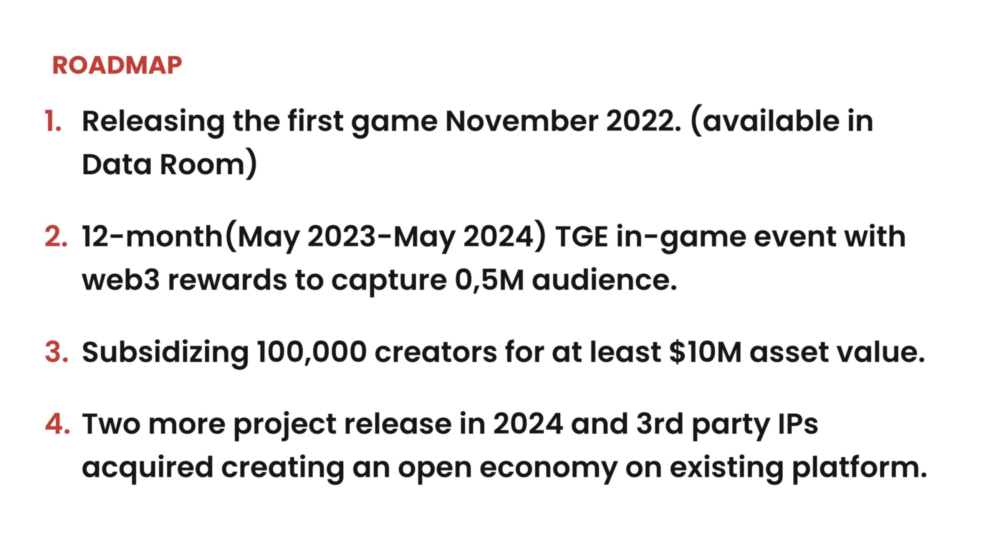

# Mintbase Grant Proposal

- **Project Name:** Overlewd NFT proposal
- **Team Name:** SupaDoge
- **Payment Address:** ponyunicorn.near
- **[Level](../README.md#level_slider-levels):** 2

## Project Overview 📄

### Overview

Supa doge is developing a platform for creators and gamers enabling a content-oriented model of distribution and monetization.

Our goal is to become the Roblox for web3.

The key USP is supporting cross-functional economy in various games through token price discovery.

Our founders previously managed independent studios creating profitable projects with up to 6-figure revenue streams, and managed esports communities.
We launched last year to produce three titles and bootstrapped and raised $1 MLN for development, first title in soft launch.

We are raising our seed round to develop the tools required to shift how the market perceives monetization and drive 60 MLN gamers into our platform!

### Project Details

Integration of NEAR into the game through the web3 event, where the NFT collection of improved characters will be introduced.

Web3 event will allow users to get unique NFTs that unlock access to improved characters and equipment. Tokens will be minted on behalf of Supa Doge DAO on the Mintbase contract. Some of them will be airdroped when user registers for the event, the other part will be distributed as a reward for completing levels.

To register on the web3 event, a user has to login to NEAR. To make this possible, we will develop an authorization module for Unity, which will be open sourced. After a user logs in, we will link blockchain account with his profile and will send NFT. It will be displayed both in the game and on Mainbase. And we will also place links to Mintbase from our interface to introduce player to the marketplace.

Rarest and most unique characters will be available on Mintbase only and won't be airdroped, they should be purchased. An advertisement will be placed inside the game, which will lead to Mintbase where a player will find rare assets.

Thus, in order to make a web3 event and attract the attention of users, we need:

- Complete gameplay for the web3 3 months event
- Produce new characters and its equipment design
- Mint huge NFT collection of game special resources
- Create Unity bindings for in-game NEAR authrization
- API service integration that transfers tokens to players

#### Technology stack

- Unity
- Node.js / Nest.js
- NEAR / near-api-js
- Mintbase API

### Ecosystem Fit

With crypto becoming more prominent day by day, and more and more people are looking for opportunities to easily get acquainted with it. Adopting a new payable audience from adult gaming and monetization is our main goals. For collaboration, we need existing tools and support from Mintbase. This will give our players the possibility to interact using assets not only in the game. All it needed is mintbase contact, API marketplace and co-promotion.

## Team 👥

### Team members

- [Nick Murashov](https://www.linkedin.com/in/nick-murashov-17255849/) — CEO
- [Aliaksandr Vasilenka](https://www.linkedin.com/in/aliaksandr-vasilenka-21788b22/) — CPO
- [Vasilisa Versus](https://www.linkedin.com/in/dcversus/) — CTO
- [Vasily Krylov](https://www.linkedin.com/in/vasily-k/) — Backend developer
- Vladimir Andreev — Unity developer
- Vitalii Ivolgin — Unity developer

### Contact

- **Contact Name:** Nick Murashov
- **Contact Email:** <a href="mailto:nick@supadoge.com">nick@supadoge.com</a>
- **Website:** [overlewd.com](https://overlewd.com)

### Legal Structure

- **Company name:**       Long Sword OÜ
- **Legal form:**         Private limited company
- **Registry code:**	    12437280
- **Registration date:**  12.03.2013 (9)
- **Address:**            Harju maakond, Tallinn, Lasnamäe linnaosa, Pae tn 25-47, 11414

### Team's experience

**[Nick Murashov](https://www.linkedin.com/in/nick-murashov-17255849/)**

Worked for $100M+ businesses increasing revenue up to 30% MoM. Managed 4 studios, created cash-positive products with $10M revenue flow.

**[Aliaksandr Vasilenka](https://www.linkedin.com/in/aliaksandr-vasilenka-21788b22/)**

20+ completed gaming titles released, overall $10M+ in funding P2E games.$1M+ in revenue, top-10 CIS esports team consultant.​

**[Vasilisa Versus](https://www.linkedin.com/in/dcversus/)**

CTO, Information security master degree, blockchain enthusiast from 2017. More than 10 years in development, was in the position head of department in several corporations.

**[Vasily Krylov](https://www.linkedin.com/in/vasily-k/)**

Tech lead and web3 follower with 7+ years of experience developing various systems. I setup development processes from scratch, work with people and solve business problems in simplest way.

**[Vasily Krylov](https://www.linkedin.com/in/warlikecracker/)**

### Team Code Repos

- [github.com/Supa-Doge](https://github.com/Supa-Doge)

Accounts of team members:

- Aliaksandr Vasilenka — [github.com/alexva244](https://github.com/alexva244)
- Vasilisa Versus — [github.com/dcversus](https://github.com/dcversus)
- Vasily Krylov — [github.com/extg](https://github.com/extg)
- Vladimir Andreev — [github.com/kbb1025doge](https://github.com/kbb1025doge)
- Vitalii Ivolgin — [github.com/gfreemon](https://github.com/gfreemon)

## Development Status 📖

Now we are developing mockups and working on the integration of authorization via NEAR.
The main gameplay is already done and we are soft launching on publisher platform.
We are looking for general partnership in web3.

Latest demo build of the game you can find on [releases page](https://github.com/Supa-Doge/overlewd-game/releases).
Also you could check our [Figma](https://www.figma.com/file/bU8hDGorjoZTT40XbZYXVk/ui-demo?node-id=0%3A1&t=xNZqvE9Vku3iDoER-1) and [Miro](https://miro.com/welcomeonboard/MUE0VTBzSzBkRHZKdkxURXJ6ck1YcjBTNzF6WElxMGFXU3BESGF3cnZvNkswOVBBcU90MTI2eTFadkNsbDdzYXwzMDc0NDU3MzU1NTMwODY2NDE4fDI=?share_link_id=41439206830)

## Development Roadmap 🔩

- **Total Estimated Duration:** 2 months
- **Full-Time Equivalent (FTE):**  5 FTE
- **Total Costs:** $25,000

### Overview

The release is scheduled for the 3rd quarter of 2023. By this point, the game will be released into production and have an active paying audience.

We plan to create an event, prepare a storyline, make art and the assets necessary for it, as well as write documentation on the event. In parallel, we will begin work on the integration of the NEAR and mintbase API both on the client and on the server.

After a month of development, we plan to build a test apk with an event where you can watch draft integration with the blockchain.

After that, we will need to update the game mechanics, the characteristics of new characters and the parameters of game levels, it will take another month of development and bringing the art to the end.

- NEAR Unity integration
- Nodejs API intergrations with mintbase contract for NFT managment
- New unique characters, equipment and dialogs for web3 event
- Design of banners and mockup for web3 event
- Event launch and marketing activities

### Milestone 1 — NEAR and mintbase intergration

- **Estimated duration:** 1 month
- **FTE:**  4
- **Costs:** 12,500 USD

| Number | Deliverable | Specification |
| -----: | ----------- | ------------- |
| 0a. | License | GPLv3 |
| 0b. | Documentation | We will provide both **inline documentation** of the code and a basic **tutorial** that explains how a user can NEAR auth integration in Unity |
| 0c. | Testing Guide | Core functions will be fully covered by unit tests to ensure functionality and robustness. In the guide, we will describe how to run these tests. |
| 0d. | Docker | We will provide a Dockerfile(s) that can be used to test all the functionality delivered with this milestone. |
| 0e. | Article | We will publish an **article**/workshop that explains |
| 1. | NEAR Unity authorization | We will create a module that will allow to authorize a user inside the Unity game |
| 2. | Nestjs API module | This server module will handle NEAR authorization from client and link with game user profile |

#### NEAR Unity integration

This will be implemented in such a way, that the user is redirected from unity to the browser, where he can authorize in his wallet, after that he is redirected back into the application by a deep link, where we can already get his login.

#### Backend

Our api server is Node.js application and it's made on top of [Nestjs](https://nestjs.com/) framework. For backend integration
we will use NEAR account credetials to authorize our system in NEAR. Through this account server will manage the distribution of NFT to our users.

### Milestone 2 — Art, assets for event

- **Estimated Duration:** 1 month
- **FTE:**  4
- **Costs:** 12,500 USD

Our expirienced content team will prepare texts, character mockups, animations
and sounds for the full launch of the web 3 event as for other events which launches in game.

| Number | Deliverable | Specification |
| -----: | ----------- | ------------- |
| 0a. | License | GPLv3 |
| 0b. | Documentation | We will provide both **inline documentation** of the code and a basic **tutorial** that explains how a user can NEAR auth integration in Unity |
| 0c. | Testing Guide | Core functions will be fully covered by unit tests to ensure functionality and robustness. In the guide, we will describe how to run these tests. |
| 1. | Assets | We will provide figma mockups and NFT collection on Mintbase |
| 2. | Nestjs API module | This server module will manage the distribution of NFT to our users. |

## Future Plans 🚀

[Sustainable Metaverse Deck](https://pitch.com/v/supa-disrupt-7nnr67)

We plan to expand the similar mechanics of assets to the other 3 titles of the studio, which will be released next year. Check out our main roadmap from the deck.

## Additional Information 📎

**How did you hear about the Grants Program?** Personal recommendation and support from [**Roketo**](https://roke.to).

At the moment our fist title in soft launch. We are running the latest tests and integrations for nutaku publisher. After that, we will continue to produce content for the new in-game events. And also marketing activities will be started.

Our main goal is replacing free-to-play as a dominant business model.
