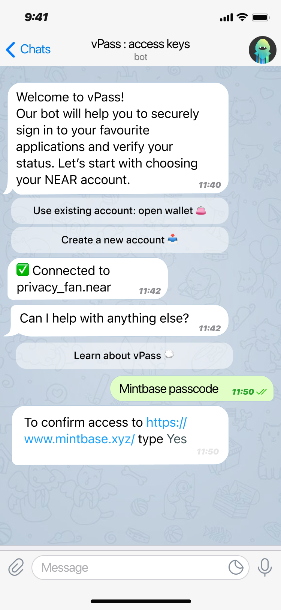
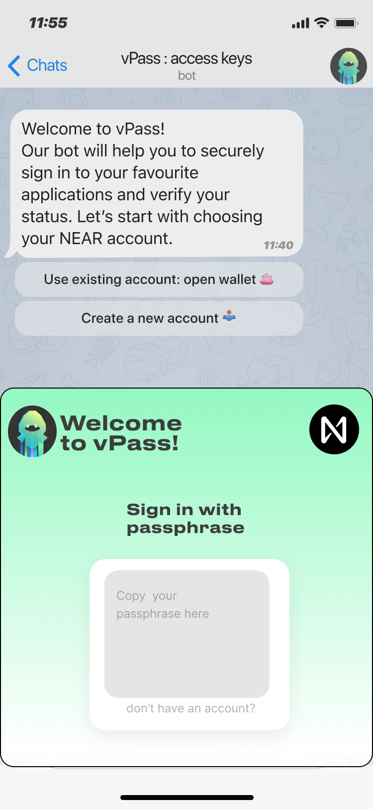

# Mintbase Grant Proposal

- **Project Name:** vSelf ZKLogin
- **Team Name:** vSelf
- **Payment Address:** vself.near
- **[Level](../README.md#level_slider-levels):** 2

## Project Overview :page_facing_up:

For mass adoption of Web3, it's crucial to balance user-friendly experiences with trust and data compliance, especially in B2B products. The vSelf team is dedicated to developing Web2.5 solutions, where our primary product is a no-code, Web3-powered platform designed to assist sales, marketing, and service teams in customer engagement and growth hacking.

In this proposal, we're honing in on a key aspect of the user journey: a straightforward yet privacy-centric authorization process embodied in our ZKLogin project. This approach is intended to simplify user experience while maintaining high privacy and security standards.

### Overview

- Privacy Meets Simplicity in Authentication: Introducing ZKLogin for the NEAR Ecosystem.
- ZKLogin represents a significant leap in the authentication domain, blending ease of use with robust privacy protections. Our solution uses conventional Web2 authorization services, like Google Sign-In and Telegram Login, to provide access to DApps in the NEAR Ecosystem without compromising the user’s identity. It blends an authentication token with a NEAR address (ephemeral or provided by the user) and passes it through a zero-knowledge proof (ZKP) service to create a unique identification for each DApp.

  ZKLogin offers a secure and private way of authentication, which is crucial for the mass adoption of the NEAR blockchain. In the NEAR ecosystem, our     
development focuses on creating an SDK for streamlined authorization processes alongside a Telegram bot designed to generate secure authorization passcodes. We aim to go beyond mere account ownership verification, incorporating an assessment of user status, such as evaluating Soulbound Tokens (SBTs). This holistic approach ensures a more comprehensive and secure authentication system tailored to the evolving needs of Web3 users.

- vSelf team has experience in designing privacy-preserving solutions, e.g., we developed a ZK-powered community membership toolkit [vStudio](https://github.com/vself-project/vstudio-metabuild). Besides, we went through [Outlier Ventures ZK Cohort](https://outlierventures.io/article/outlier-ventures-announces-first-cohort-for-zero-knowledge-base-camp/), where we explored cutting-edge privacy tech with our mentors.

### Project Details

- **PoC/MVP and Prior Work:**
  The project is inspired by a recent release of the [zkLogin](https://sui.io/zklogin) in the Sui ecosystem. The original work presented a concept of web2.5 authorization that was executed for the Sui blockchain and [audited](https://www.zksecurity.xyz/blog/posts/zklogin/).

  In the current proposal, we expand on this solution while continuing our own previous zkp-related work: [vStudio tools for private membership.](https://devpost.com/software/vstudio-private-onboarding-to-web3-communities) It focused on the idea of smooth onboarding of the users into communities and Web3-powered campaigns (like DAO activations, voting, or SMM engagement) without compromising the account data with which the user verified its membership. [To build it](https://github.com/vself-project/vstudio-metabuild), we used Bulletproofs, which is a well-established ZK-proof system without a trusted setup (unlike some zkSNARKs). On top of Bulletproofs, we built our R1CS circuit to prove set membership in zero-knowledge, so on-chain data doesn't reveal members’ identities. This was quite an experimental approach: we used MiMC hash under the hood (as it has low multiplicative complexity). The produced proof contains zero-knowledge attestation of the fact that one knows a secret behind the member’s public commitment and simultaneously belongs to a set of members.

- **Deliverables**

  1. **ZKLogin SDK npm package** (partially compiled from Rust to WebAssembly).

  NEAR ecosystem members can use it to generate & verify proofs of account ownership. It is limited to two types of Web2 accounts (Google and Telegram) and NEAR Web3 addresses.

  2. **vPass** Telegram bot

  - It allows users to seamlessly authorize in dApps and gated Telegram groups and channels, using their combination of NEAR address and Telegram account and generating ZKLogin for each request. vPass utilizes ZKLogin SDK to run proof verification and connects to NEAR infrastructure for on-chain data.
  - vPass bot can be set up by the admin to check more specific credentials of the users, e.g. SBTs or NFTs of particular kind and conditions of ownership, that could be derived from on-chain data.
  - vPass TMA (Telegram mini-application), which manages user identity (including SSO with Google) and enables to production of zk-proofs for future logins (using the same SDK).
  - Testnet gated Telegram channel, which is moderated by vPass bot and only accessible on customizable conditions (like having specific SBT).

- **UI Components**
  The project will include intuitive and user-friendly interface designs in two forms: Telegram bots and web plugin. These mockups will showcase the login process through Telegram vPass bot using NEAR account and the user journey involving ephemeral and personal account management.

  
  

- **Project Limitations**
  vSelf ZKLogin will not provide a full-fledged identity management system beyond the scope of user authentication and status verification described in this proposal. It will focus primarily on the use cases suitable for the NEAR and Mintbase ecosystems.

  The initial vPass release will be limited in terms of UX and feature set on the admin side. Future versions will aim to expand these capabilities. This detailed breakdown of deliverables and milestones sets clear expectations and provides a roadmap for the development of vSelf ZKLogin.

#### Technology Stack Overview

- **Frontend**: **Next.js 14 T3 stack** (Typescript/Tailwind CSS) for dynamic and responsive UI, Telegram bot (Telegraf.js), Telegram Web App.
- **Backend**: Node.js service for handling API requests and integration with NEAR blockchain.
- **Database**: **Firebase** & **Google Cloud** are used for hosting and content delivery, and identity management.
- **Auth**: The Single Sign-On protocol supported by is **[OAuth 2.0](https://oauth.net/2/)**. In which a user can log into a trusted third party (Google, Facebook, etc.) and get a signed token attesting that they logged in in the form of a signed **[JSON Web Token](https://jwt.io/)** (JWT).
- **Blockchain**: NEAR protocol and Rust smart contracts for blockchain-based interactions, particularly for handling authentication and NFT-related processes. For NEAR integration, we use **NEAR JS SDK** & **WalletSelector.**
- **Crypto**: Zero-knowledge proofs **Bulletproofs** & **R1CS circuit** implementation in Rust ensures user privacy and safety.

### Ecosystem Fit
- Where and how does your project fit into the ecosystem?
  We are natively building on NEAR Protocol as we are proponents of NEAR tech, particularly account abstraction and its good fit for Web2.5 adoption. We see wallet-type of authorization as a big friction point for non-crypto native customers. Besides, existing alternative solutions are often unsuitable to meet business needs for data management regulation. We aim to provide a new open-source tool to foster the adoption process and bridge current gaps in the market.
  
- Who is your target audience?
    This project targets NEAR-compatible or NEAR-native DApps and their Telegram communities, which could benefit from the integration of our bot and/or SDK for private or gated access. Besides, all their users will leverage these tools, whether they’re already NEAR adopters or newcomers.
    
- What need(s) does your project meet?
    There is a need for seamless onboarding techniques (including Web2 ways), as well as a reduction of on-chain footprint (we prefer to limit the exposure of the data to only what is necessary.).
    
- Are there any other projects similar to yours in the Mintbase / NEAR ecosystem?
    None we are aware of, though we have examples on other chains (like Sui). In the NEAR ecosystem, there are other solutions facilitating authorization, like FastAuth (email key recovery) and Keypom (linkdrop mechanics), but they are complimentary and can be used along with zkLogin as a last-mile solution.

## Team :busts_in_silhouette:

### Team members

- Tatiana Yakushkina (CEO, product manager, blockchain architect)
- Roxana Balan (CMO, customer journey manager)
- Sergey Kozlov (Full Stack Dev)
- Anttoni Viital (Full Stack Dev)

### Contact

- **Contact Name:** Tatiana Yakushkina
- **Contact Email:** ty@vself.app
- **Website:** https://vself.app/

### Legal Structure

- **Registered Address:** 68 CIRCULAR ROAD 02-01 SINGAPORE (049422)
- **Registered Legal Entity:** VSELF PTE. LTD.

### Team's experience

The vSelf team has been contributing to the NEAR ecosystem since the end of 2021, focusing on identity applications and data management. We successfuly delivered a project for a grant from Human Guild (NEAR Foundation [grant report](https://gov.near.org/t/proposal-vself-learn-to-earn-app-for-participation-in-events-meetups-and-courses/11368)) and later won the Best Design Prize at the MetaBUILD Hackathon ([our demo](https://devpost.com/software/vself)). Besides, we completed a ZK cohort of the Outlier Ventures acceleration program with less than 3% of applicants accepted.  
Tatiana holds a PhD in applied mathematics and has spent ten years in academia, doing research in computer science and teaching at the business informatics department (including courses on blockchain business applications). Together with our full-stack developer Sergey, she had worked on the previous startup, Nuland, in the blockchain space: a Web3 app to allow the tokenisation of rewards for user engagement and feedback based on geolocation. During 2020, it secured cooperation with MIT PathCheck ([collaborative pilot](https://github.com/nuland-project/safe-path-sm)) intended to customise their digital contract tracing (DCT) technology and deploy it to production in the San Marino Republic. Roxana has extensive experience in customer behaviour research, incorpoorating marketing, and cusdev insights into bespoke user journeys. Anttoni is a seasoned blockchain and full-stack dev, bringing the experience of working with the most modern tech stack across platforms. This powerful combination of skills enables them to navigate the complexities of the web3 ecosystem effectively, driving innovation and creating cutting-edge solutions that cater to the evolving needs of the digital landscape.

Previously, [the team attempted to apply](https://www.notion.so/Mintbase-2024-be66e748b26940d08aca0fc619587dcd?pvs=4#4b4e2acb0a974439bc18614a54a24c32) for a Mintbase grant (but didn’t submit it correctly). Earlier, an [application for identity management was supported by the NEAR Foundation](https://gov.near.org/t/proposal-vself-learn-to-earn-app-for-participation-in-events-meetups-and-courses/11368).

### Team Code Repos

- https://github.com/vself-project
- https://github.com/vself-project/vself-dao
- https://github.com/vself-project/vstudio-metabuild
- https://github.com/vself-project/vself-beta
- https://github.com/vself-project/vself-brands

GitHub accounts of team members:

- https://github.com/sergantche
- https://github.com/legendaryangelist
- https://github.com/mrpejker

### Team LinkedIn Profiles (if available)

- https://www.linkedin.com/in/tyakushkina/
- https://www.linkedin.com/in/roxanabalan/
- https://www.linkedin.com/in/sergey-kozlov-7b3520127/
- https://www.linkedin.com/in/anttoni-viitala-69296124a/

## Development Status :open_book:

vSelf ZKLogin project is an evolution of our research and development focused on bringing Web3 data management for mass adoption in loyalty and SMM verticals for the general audience of brands. We expand on the solution for private community membership, designed as vStudio project, by incorporating insights and methodologies from the [zkLogin framework developed in the Sui ecosystem](https://sui.io/zklogin). Below, we outline our preparatory work, developmental milestones, and collaborations that have shaped the current state of ZKLogin:

- **Continuation of vStudio Research**: Building on our previous work with vStudio, which focused on privacy-preserving community engagement tools, we are extending our research to include advanced zero-knowledge proof (ZKP) technologies. This ongoing effort is documented in our [vStudio repository](https://github.com/vself-project/vstudio-metabuild), showcasing our commitment to enhancing privacy without compromising user convenience or security.
    - A pure-Rust implementation of group operations on Ristretto and Curve25519. https://doc.dalek.rs/curve25519_dalek/index.html
    - BulletProofs https://github.com/zkcrypto/bulletproofs
    - Zero-Knowledge Proofs for Set Membership: Efficient, Succinct, Modular https://link.springer.com/chapter/10.1007/978-3-662-64322-8_19
    - zkKYC https://eprint.iacr.org/2021/907.pdf
- **Incorporation of zkLogin data flow from Sui**: Inspired by the innovative approach of zkLogin within the Sui ecosystem, our project adapts and extends these concepts for the NEAR platform. This cross-ecosystem adaptation leverages the strengths of zkLogin's authorization mechanisms, aiming to address the unique challenges faced by users and developers within the NEAR ecosystem.
    - https://docs.sui.io/concepts/cryptography/zklogin/
- **Engagement with Academic and Developer Communities**: Our team has actively contributed to discussions and shared our findings with both academic and developer communities, highlighting our advancements in zero-knowledge proofs and blockchain-based identity management. Our team participates in NEAR Zero Knowledge Community Group, zkDay conferences and meetups and regularly connects with our mentors from Aleo, zkSync, and ScalingX.

## Development Roadmap :nut_and_bolt:

### Overview

- **Total Estimated duration:** 6 months
- **FTE:** 3
- **Costs:** 50,000 USD

### Milestone 1 ZKLogin SDK npm package 

- **Estimated duration:** 2 month
- **FTE:** 3
- **Costs:** 20,000 USD

| Number | Deliverable            | Specification                                                                                                                                                                                                                                |
|-------:|------------------------|-----------------------------------------------------------------------------------------------------------------------------------------------------------------------------------------------------------------------------------------------|
| 0a.    | License                | Apache 2.0 / GPLv3 / MIT / Unlicense. Open-sourced to ensure community engagement and compliance with grant requirements.                                                                                                                       |
| 0b.    | Documentation          | Detailed documentation covering API usage, integration guides for NEAR blockchain interactions, and examples of implementing ZKLogin in DApps. Also includes an architectural overview emphasizing cryptographic components.                    |
| 0c.    | Testing Guide          | Instructions for setting up and executing unit and integration tests, ensuring all cryptographic functions operate as intended. Will cover testing environments setup, including Docker configurations for consistent testing across platforms. |
| 0d.    | Docker                 | Dockerfile(s) to facilitate environment setup for development, testing, and demonstrations of ZKLogin functionality.                                                                                                                           |
| 0e.    | Article                | An article/workshop detailing the creation and application of ZKLogin, focusing on the cryptographic challenges addressed, solutions implemented, and the impact on user privacy within Web3.                                                    |
| 1.     | ZKLogin SDK npm package | The npm package, partially compiled from Rust to WebAssembly, enabling DApps to utilize ZKLogin for authentication. Includes cryptographic protocols for zero-knowledge proofs ensuring user privacy.                                           |
| 2.     | Cryptographic Protocols | Specification and implementation of cryptographic protocols using zero-knowledge proofs to secure user authentication without revealing unnecessary data. Based on Bulletproofs for efficient, trustless proofs.                                 |

### Milestone 2 vPass Telegram bot v1

- **Estimated Duration:** 2 month
- **FTE:** 3
- **Costs:** 15,000 USD

| Number | Deliverable                 | Specification                                                                                                                                                                                                                           |
|-------:|-----------------------------|------------------------------------------------------------------------------------------------------------------------------------------------------------------------------------------------------------------------------------------|
| 0a.    | License                     | Apache 2.0 / GPLv3 / MIT / Unlicense. The bot's source code will be available under an open-source license to encourage community contributions and ensure broad usability.                                                                |
| 0b.    | Documentation               | Comprehensive documentation will cover the bot's architecture, setup, usage, and integration guide with NEAR blockchain for authorization purposes. Documentation will be made public in the GitHub repository for community accessibility. |
| 0c.    | Formatted Code              | The codebase will adhere to a consistent style, facilitating readability and maintenance. Style guidelines will be followed as per [official recommendations](https://github.com/paritytech/substrate/blob/master/docs/STYLE_GUIDE.md).  |
| 0d.    | Testing Guide               | A detailed testing guide will include unit tests for all logical components and integration tests to ensure seamless interaction with NEAR blockchain services. Dockerfiles will be provided for environment setup.                         |
| 1.     | Frontend Development        | Development of the bot's user interface using Telegraf.js for interaction with Telegram API. The UI will be intuitive, guiding users through the authorization process with clear instructions and feedback.                              |
| 2.     | Backend Development         | Node.js with Express framework will be utilized for backend development, handling requests between the Telegram bot and NEAR blockchain. The backend will also manage user sessions and authorization tokens securely.                     |
| 3.     | vPass Telegram Bot          | The deliverable will be a functional Telegram bot enabling users to authorize with their NEAR account seamlessly. The bot will support authorization flows and provide users with confirmation of successful authentication.             |
| 4.     | Integration Tests and Docker| Integration testing will ensure the bot's compatibility and functionality within the NEAR ecosystem, with Dockerfiles supplied for replicating test environments.                                                                         |

### Milestone 3 vPass Telegram bot v2

- **Estimated Duration:** 2 month
- **FTE:** 3
- **Costs:** 15,000 USD

| Number | Deliverable                      | Specification                                                                                                                                                                                                                              |
|-------:|----------------------------------|---------------------------------------------------------------------------------------------------------------------------------------------------------------------------------------------------------------------------------------------|
| 0a.    | License                          | Apache 2.0 / GPLv3 / MIT / Unlicense. Ensuring the project remains open-source for community use and contribution.                                                                                                                           |
| 0b.    | Documentation                    | Detailed documentation of the bot's extended features, including setup guides for moderation parameters, interaction flows for enhanced user verification, and examples of advanced usage scenarios.                                       |
| 0c.    | Formatted Code                   | Adherence to a consistent coding style for readability and maintainability, following [official style guidelines](https://github.com/paritytech/substrate/blob/master/docs/STYLE_GUIDE.md) for clarity and community standards.           |
| 0d.    | Testing Guide                    | Comprehensive testing guide covering unit and integration tests, especially focusing on new functionalities. Includes Dockerfile setups to replicate testing environments, ensuring reliability across various platforms.                   |
| 1.     | Advanced Frontend Interface      | Development of advanced frontend functionalities using Telegraf.js for Telegram bot interactions, incorporating UI components for admins to set moderation parameters and users to navigate complex authorization processes easily.        |
| 2.     | Backend Development for Moderation| Utilization of Node.js with Express to enhance backend capabilities, supporting complex user verification mechanisms, moderation parameter settings, and integration with NEAR blockchain for secure and scalable user management.         |
| 3.     | vPass Telegram Bot Enhanced Version| Implementation of the vPass Telegram bot with advanced features, allowing for customizable moderation settings, gated community access based on user verification, and secure management of user credentials and permissions within groups.|
| 4.     | Integration Tests and Docker     | Detailed integration testing of the bot within the NEAR ecosystem, focusing on the robustness of moderation functionalities and user verification processes, with Dockerfile provided for consistent test setups.                         |

 

## Future Plans

- **Utilization and Enhancement**: In the immediate future, our focus is on deploying ZKLogin for live testing within selected NEAR ecosystem applications. This phase will allow us to gather real-world feedback, crucial for refining our solution. Concurrently, we plan to enhance ZKLogin's capabilities, specifically its integration flexibility with various DApps and its scalability to handle a growing user base.
- **Promotion and Documentation**: We will embark on a comprehensive promotional campaign targeting both the existing NEAR ecosystem and potential new adopters from traditional Web2 backgrounds. This will involve active participation in relevant blockchain and privacy-focused AMAs and meetups. To ensure users and developers can easily integrate and use ZKLogin, we will develop extensive documentation, including tutorials and  guides.

## Additional Information :heavy_plus_sign:

**How did you hear about the Grants Program?**  Twitter 

